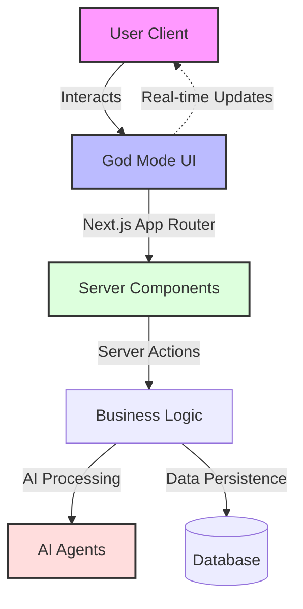

# Awazdo

Awazdo is a next-generation platform designed to revolutionize how users interact with AI and digital workflows. By providing a "God Mode" interface, we empower users to manage complex systems with simplicity and elegance.


## 🌟 Company Vision

**"Empowering Creativity through God Mode Intelligence"**

At Awazdo, our vision is to bridge the gap between human intention and digital execution. We believe in creating tools that are not just functional but transformative. We aim to:

*   **Democratize Power:** give every user the ability to control advanced AI agents and workflows effortlessly.
*   **Elevate Design:** prove that powerful tools can be beautiful, intuitive, and a joy to use.
*   **Accelerate Innovation:** remove the friction from creation, allowing users to focus on *what* they want to build, not *how* to build it.

We envision a future where technology feels like an extension of the mind—seamless, immediate, and powerful.

## 🏗️ Work Architecture

Awazdo is built on a cutting-edge, scalable architecture that prioritizes performance, user experience, and developer productivity.



### Frontend Foundation
*   **Framework:** [Next.js 16](https://nextjs.org/) (App Router) - Leveraging the latest in React server components and routing for blazing-fast performance.
*   **Library:** [React 19](https://react.dev/) - utilizing the newest concurrent features and server actions.
*   **Language:** TypeScript - Ensuring type safety and code reliability across the entire stack.

### Design System & UI/UX
*   **Styling:** [Tailwind CSS v4](https://tailwindcss.com/) - Utility-first CSS for rapid, maintainable, and responsive design.
*   **Animations:** [Framer Motion](https://www.framer.com/motion/) - Delivering smooth, complex animations that give the application its "premium" feel.
*   **Icons:** [Lucide React](https://lucide.dev/) - A consistent and beautiful icon set.
*   **Components:** Modular, accessible components designed for reusability and consistency.

### Core Architecture Pillars
1.  **Server-First Approach:** Heavy lifting is done on the server using Next.js Server Actions to keep the client bundle small and fast.
2.  **Component-Driven Development:** UI is built as isolated, reusable components to ensure consistency and speed up development.
3.  **Optimization:** Automatic image optimization, font loading (Geist), and code splitting are built-in.

## ⚗️ Working with God Mode Formulas

The **God Mode Formula System** is the engine behind Awazdo's automation. It allows users to chain AI agents, manipulate data, and define complex logic without writing traditional code.

### Core Concepts
1.  **Natural Language Triggers:** Formulas can be initiated by simple text commands (e.g., "When a new lead arrives...").
2.  **Visual Logic Builder:** A node-based interface to drag-and-drop conditions, loops, and actions.
3.  **Cross-Agent Communication:** Use formulas to pass data from one AI agent (e.g., "Researcher") to another (e.g., "Writer").

### Example Workflow
> **Goal:** Automate weekly report generation.
> **Formula:** `Timer(Weekly) -> DataFetcher(SalesDB) -> AI_Analyzer(Summarize) -> EmailSender(Team)`

This system empowers users to build bespoke tools on top of the Awazdo platform instantly.

## 🚀 Getting Started

Follow these steps to set up the project locally.

### Prerequisites
*   Node.js 18+ or later
*   npm, yarn, pnpm, or bun

### Installation

1.  Clone the repository:
    ```bash
    git clone https://github.com/parmarjh/Awazdo-.git
    cd Awazdo-
    ```

2.  Install dependencies:
    ```bash
    npm install
    # or
    yarn install
    ```

3.  Run the development server:
    ```bash
    npm run dev
    ```

4.  Open [http://localhost:3000](http://localhost:3000) with your browser to see the result.

## 🤝 Contributing

We welcome contributions to make Awazdo even better! Please read our contributing guidelines before submitting a pull request.

## 📄 License

[MIT](LICENSE)
