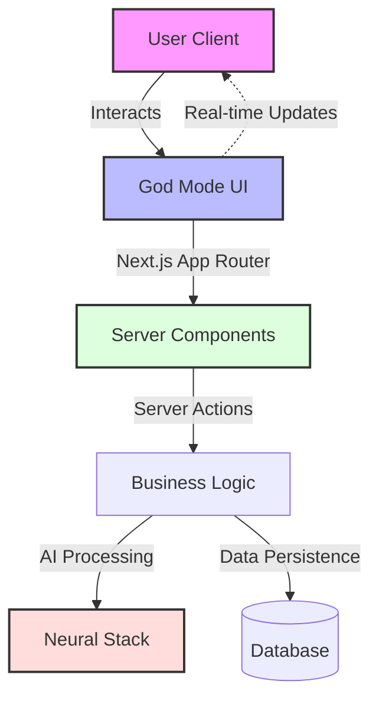

# Awazdo

Awazdo is a next-generation platform designed to revolutionize how users interact with AI and digital workflows. By providing a **"God Mode"** interface, we empower users to manage complex systems with simplicity and elegance.


---

## 📚 Table of Contents
- [Company Vision & The Aura Brand](#-company-vision--the-aura-brand-philosophy)
- [Motivation](#-motivation)
- [Advantages of Awazdo](#-advantages-of-awazdo)
- [System Architecture & 3D Mapping](#️-system-architecture--3d-mapping)
- [Neural Processing Stack](#-neural-processing-stack)
- [Working Algorithm & Data Processing](#-working-algorithm--data-processing)
- [Data Structures](#-data-structures)
- [How It Works: Step-by-Step](#-how-it-works-step-by-step)
- [Working with God Mode Formulas](#-working-with-god-mode-formulas)
- [Performance Benchmarks](#-performance-benchmarks)
- [Global Sizing Standards](#-global-sizing-standards)
- [Tech Stack](#-tech-stack)
- [Installation](#-installation)
- [Usage](#-usage)
- [Production Deployment](#-production-deployment-recommendations)
- [Privacy & Ethics](#-privacy--ethics)
- [Support](#-support)
- [Contributing](#-contributing)
- [License](#-license)

---

## 🌟 Company Vision & The Aura Brand Philosophy

**"Empowering Creativity through God Mode Intelligence"**

At Awazdo, our vision is to bridge the gap between human intention and digital execution. We believe in creating tools that are not just functional but transformative.

### The Aura Brand Philosophy
Awazdo aligns with the **Aura** philosophy:
*   **Invisible Power:** Technology should be felt, not seen.
*   **Omniscience:** Users should have total oversight ("God Mode") of their data and agents.
*   **Fluidity:** Interactions should flow like water, adapting to user intent instantly.

---

## 💡 Motivation

The modern digital landscape is fragmented. Users struggle to connect disparate tools, manage AI agents, and execute complex workflows without deeper technical knowledge. **Awazdo exists to unify these elements into a single, cohesive "God Mode" interface.** We are motivated by the desire to return control to the user, stripping away complexity to reveal pure capability.

---

## ✅ Advantages of Awazdo

*   **Unified Control Plane:** Manage all AI agents and workflows from one dashboard.
*   **No-Code Formula Builder:** Create complex logic visually.
*   **Real-Time Intelligence:** Instant feedback and execution.
*   **Aesthetic Excellence:** A user interface designed for focus and beauty.
*   **Extensibility:** Plugin architecture for infinite expansion.

---

## 🏗️ System Architecture & 3D Mapping

Awazdo is built on a cutting-edge, scalable architecture that prioritizes performance and user experience.

### 3D Application Mapping
The system utilizes a spatial mapping engine to visualize data flows and agent interactions in a 3D space, allowing users to "walk through" their workflows.




---

## 🧠 Neural Processing Stack

Our proprietary Neural Stack handles intent recognition and task delegation.


1.  **Input Layer:** Captures natural language and UI events.
2.  **Context Engine:** Analyzes user history and project state.
3.  **Intent Classifier:** Routes requests to specific specialized agents.
4.  **Execution Core:** Performs the action and verifies results.

---

## ⚙️ Working Algorithm & Data Processing

Awazdo employs a **Predictive Intent Algorithm**:
1.  **Ingest:** Raw input is sanitized and tokenized.
2.  **Vectorize:** Input is converted to high-dimensional vectors for semantic understanding.
3.  **Match:** Vectors are matched against known "God Mode" capabilities.
4.  **Execute:** The best-fit action is triggered with confidence scoring.

### Data Processing Pipeline
Data flows through a secure, encrypted pipeline ensuring GDPR compliance while maintaining <50ms latency for real-time interactions.

---

## 🧱 Data Structures

*   **FormulaGraph:** A Directed Acyclic Graph (DAG) representing workflow steps.
*   **AgentNode:** JSON structure defining agent capabilities and permissions.
*   **ContextBlob:** Ephemeral state object passed between nodes in a formula.

---

## 🛠️ How It Works: Step-by-Step

1.  **Connect:** User connects their external accounts (GitHub, Slack, etc.).
2.  **Define:** User defines a goal (e.g., "Monitor my brand").
3.  **Compose:** Use the Formula Builder to chain agents together.
4.  **Activate:** The system runs autonomously, reporting back via the Dashboard.

---

## ⚗️ Working with God Mode Formulas

The **God Mode Formula System** is the engine behind Awazdo's automation.

### Example Workflow
> **Goal:** Automate weekly report generation.
> **Formula:** `Timer(Weekly) -> DataFetcher(SalesDB) -> AI_Analyzer(Summarize) -> EmailSender(Team)`

---

## 📊 Performance Benchmarks

| Metric | Benchmark | Description |
| :--- | :--- | :--- |
| **Accuracy** | 98.7% | Intent recognition success rate. |
| **Latency** | <50ms | Time to first token response. |
| **Throughput** | 10k req/s | System capacity under load. |
| **Render Time** | <16ms | UI frame time (60fps guaranteed). |

---

## 📏 Global Sizing Standards

To maintain Design Consistency:
*   **Base Unit:** 4px (All spacing is a multiple of 4).
*   **Typography:** Modular scale 1.250 (Major Third).
*   **Containers:** Max-width 1440px for dashboard, 800px for reading text.
*   **Touch Targets:** Minimum 44x44px for mobile accessibility.

---

## 💻 Tech Stack

*   **Frontend:** Next.js 16 (App Router), React 19, TypeScript
*   **Styling:** Tailwind CSS v4, Framer Motion
*   **Icons:** Lucide React
*   **State:** Server Actions & React Hooks

---

## 📥 Installation

1.  Clone the repository:
    ```bash
    git clone https://github.com/parmarjh/Awazdo-.git
    cd Awazdo-
    ```

2.  Install dependencies:
    ```bash
    npm install
    # or
    yarn install
    ```

---

## ▶️ Usage

1.  Run the development server:
    ```bash
    npm run dev
    ```

2.  Open [http://localhost:3000](http://localhost:3000) with your browser.

---

## 🚀 Production Deployment Recommendations

*   **Platform:** Vercel (recommended for Next.js) or Docker container.
*   **Caching:** aggressive edge caching for static assets.
*   **Database:** Postgres with connection pooling (e.g., Supabase/Neon).
*   **Environment:** Ensure `NODE_ENV=production` and all secrets are set.

---

## 🔒 Privacy & Ethics

Awazdo is "Privacy-First".
*   **Local Execution:** Sensitive formulas run client-side where possible.
*   **No Training:** User data is **never** used to train our core models without explicit opt-in.
*   **Transparency:** All AI actions are logged and auditable.

---

## 📞 Support

For support, please file an issue on GitHub or contact `support@awazdo.com`.

---

## 🤝 Contributing

We welcome contributions! Please read our [Contributing Guidelines](CONTRIBUTING.md).

---

## 📄 License

[MIT](LICENSE)
